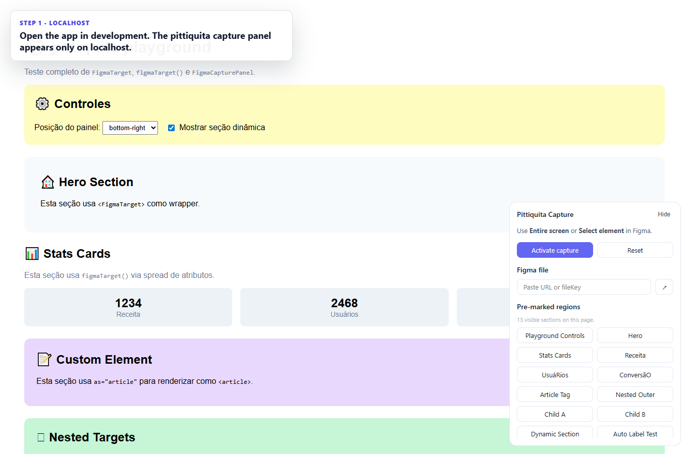
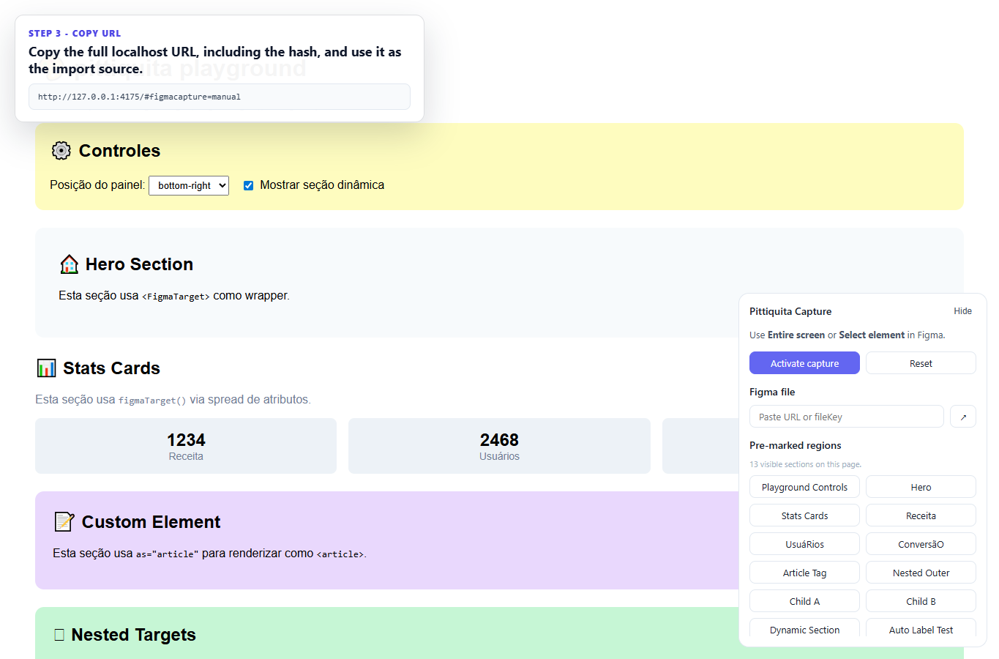
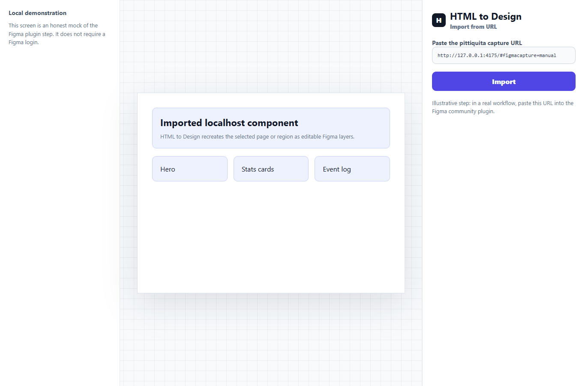

# pittiquita

> Toolkit React exclusivo de desenvolvimento para capturar componentes vivos do localhost e levar para o Figma via HTML to Design.

<p>
  <a href="https://www.npmjs.com/package/pittiquita"></a>
  <a href="https://www.npmjs.com/package/pittiquita"></a>
  <a href="https://github.com/pedronazarito98/pittiquita/blob/main/LICENSE"></a>
  <a href="https://bundlephobia.com/package/pittiquita"></a>
</p>

**Idioma:** Portugues (padrao) | [English](https://github.com/pedronazarito98/pittiquita/blob/main/README.en.md)

`pittiquita` acelera o fluxo Design <-> Code. Ele adiciona um pequeno painel de captura em apps React locais, permite marcar regioes uteis da pagina e prepara a URL atual do localhost para uso no plugin [HTML to Design](https://www.figma.com/community/plugin/1159123024924461424/html-to-design) do Figma.

Ele e seguro para SSR, roda apenas em localhost, e tree-shakeable e foi desenhado para ter zero impacto em producao.

- npm: [pittiquita](https://www.npmjs.com/package/pittiquita)
- GitHub: [pedronazarito98/pittiquita](https://github.com/pedronazarito98/pittiquita)
- Licenca: [MIT](./LICENSE)
- Demo visual: [docs/demo](./docs/demo)

## Demo Visual

A demo mostra o fluxo principal:

```txt
localhost -> ativar captura -> URL pronta -> colar no Figma / HTML to Design
```

| Painel no localhost | Captura ativa |
| --- | --- |
|  |  |

| Copiar URL | Passo no HTML to Design |
| --- | --- |
|  |  |

A ultima tela e um mock local ilustrativo. Ela documenta onde colar a URL no HTML to Design sem exigir login no Figma ou uma sessao real do plugin.

Regere os screenshots com:

```bash
pnpm build
pnpm --dir playground install
pnpm run demo:capture
```

Se o Playwright nao encontrar um navegador na sua maquina, instale o Chromium uma vez:

```bash
pnpm exec playwright install chromium
```

## O Problema

Designers e engenheiros muitas vezes precisam inspecionar o estado real renderizado de um componente antes de leva-lo de volta ao Figma. O fluxo manual costuma ser lento:

1. Abrir o DevTools.
2. Encontrar o node certo no DOM.
3. Copiar HTML manualmente.
4. Colar em um plugin do Figma.
5. Repetir quando o estado do componente muda.

Esse processo e fragil porque o que importa nao e apenas o componente fonte. E o componente vivo, com props, CSS, dados, layout e estado renderizado pelo navegador.

## A Solucao

`pittiquita` adiciona um helper local de captura ao seu app React.

Com ele voce pode:

- Ativar o modo de captura para Figma por um painel flutuante.
- Copiar a URL atual do localhost com o hash de captura pronto.
- Marcar regioes especificas da pagina como alvos nomeados.
- Navegar ate esses alvos diretamente pelo painel.
- Manter a ferramenta de captura fora da producao.

O handoff fica simples: rode o app localmente, ative a captura, copie a URL e cole no plugin HTML to Design dentro do Figma.

## Quando Usar

Use `pittiquita` quando voce quiser:

- Levar estados reais de UI React para o Figma para revisao ou iteracao.
- Documentar estados de componentes a partir de um ambiente local.
- Dar ao time de design um caminho estavel para importar telas renderizadas sem DevTools.
- Capturar regioes especificas como hero, pricing, cards, formularios ou dashboards.
- Manter esse fluxo exclusivo de desenvolvimento e seguro para bundles de producao.

Ele nao substitui design tokens, bibliotecas de componentes, Storybook ou componentes nativos do Figma. Ele e uma ponte para capturar estados HTML vivos rapidamente.

## Instalacao

```bash
pnpm add pittiquita
```

Peer dependencies:

```txt
react >=18
react-dom >=18
```

## Uso Rapido

Renderize o painel dentro de uma arvore React no cliente:

```tsx
import { FigmaCapturePanel } from 'pittiquita'

export function App() {
  return (
    <>
      <YourApplication />
      <FigmaCapturePanel />
    </>
  )
}
```

Inicie seu servidor de desenvolvimento e abra uma URL localhost. O painel retorna `null` fora de `localhost` e `127.0.0.1`.

## Exemplo Com Next.js

No App Router, coloque um pequeno Client Component proximo ao layout raiz.

```tsx
// app/PittiquitaPanel.tsx
'use client'

import { usePathname } from 'next/navigation'
import { FigmaCapturePanel } from 'pittiquita'

export function PittiquitaPanel() {
  return <FigmaCapturePanel pathname={usePathname()} />
}
```

```tsx
// app/layout.tsx
import type { ReactNode } from 'react'
import { PittiquitaPanel } from './PittiquitaPanel'

export default function RootLayout({ children }: { children: ReactNode }) {
  return (
    <html lang="pt-BR">
      <body>
        {children}
        {process.env.NODE_ENV === 'development' ? <PittiquitaPanel /> : null}
      </body>
    </html>
  )
}
```

O guard `NODE_ENV` e opcional porque o componente ja verifica localhost, mas ajuda bundlers a removerem UI exclusiva de desenvolvimento de branches de producao.

## Exemplo Com Vite

Use o plugin do Vite para injetar o painel automaticamente durante `vite dev`:

```ts
// vite.config.ts
import react from '@vitejs/plugin-react'
import { defineConfig } from 'vite'
import { pittiquita } from 'pittiquita/vite'

export default defineConfig({
  plugins: [react(), pittiquita()],
})
```

O plugin Vite roda apenas durante o servidor de desenvolvimento. Builds de producao ficam intocados.

Voce tambem pode renderizar `<FigmaCapturePanel />` manualmente em um app Vite se preferir controle explicito.

## Marcando Regioes

Regioes marcadas aparecem no painel como atalhos nomeados. Ao selecionar uma, o painel rola ate o elemento e destaca a area para captura.

### Com `FigmaTarget`

```tsx
import { FigmaTarget } from 'pittiquita'

export function MarketingPage() {
  return (
    <FigmaTarget name="hero-section" label="Hero">
      <section>
        <h1>UI pronta para design</h1>
      </section>
    </FigmaTarget>
  )
}
```

### Com `figmaTarget`

Use o helper quando nao quiser criar um wrapper extra no DOM:

```tsx
import { figmaTarget } from 'pittiquita'

export function PricingCards() {
  return (
    <section {...figmaTarget('pricing-cards', { label: 'Pricing cards' })}>
      ...
    </section>
  )
}
```

As duas APIs escrevem os atributos `data-figma-target` e `data-figma-label`. O painel descobre essas regioes automaticamente com `MutationObserver`.

## Como A Captura Funciona

1. `FigmaCapturePanel` renderiza apenas em `localhost` ou `127.0.0.1`.
2. Clicar em `Activate capture` adiciona `#figmacapture=manual` a URL atual.
3. Quando esse hash esta presente, o pittiquita injeta o script de captura do Figma HTML to Design.
4. Voce copia a URL completa do localhost.
5. No Figma, abra o HTML to Design e importe por URL.
6. O plugin le a pagina renderizada e recria a tela como camadas editaveis no Figma.

O painel marca a si mesmo com `data-figma-helper` para que a UI auxiliar possa ser ignorada pela logica de captura.

## Hooks Headless

Se quiser criar sua propria UI, importe o entry point de hooks:

```tsx
import {
  useFigmaCapture,
  useFigmaFileRef,
  useFigmaRegions,
  useLocalOrigin,
} from 'pittiquita/hooks'

export function CustomCaptureToolbar() {
  const isLocal = useLocalOrigin()
  const { activate } = useFigmaCapture({ enabled: isLocal })
  const { regions } = useFigmaRegions({ enabled: isLocal })
  const fileRef = useFigmaFileRef()

  if (!isLocal) return null

  return (
    <div>
      <button type="button" onClick={activate}>
        Capturar
      </button>
      <span>{regions.length} regioes</span>
      <input value={fileRef.value} onChange={(event) => fileRef.setValue(event.target.value)} />
    </div>
  )
}
```

## Arquitetura

```txt
src/
  core/
    hooks/      hooks React com guards de browser
    utils/      captura, file-ref, labels e utilitarios de regioes
    types.ts    tipos publicos compartilhados
  react/
    FigmaCapturePanel.tsx
    FigmaTarget.tsx
    components/
    styles.ts   estilos inline e CSS custom properties
  vite/
    plugin.ts   injecao Vite exclusiva de desenvolvimento
  next/
    plugin.ts   entry point auxiliar para configuracao Next.js
tests/
  core/
  react/
playground/
  app demo Vite linkado ao pacote local
docs/demo/
  walkthrough visual gerado com Playwright
```

Entry points publicos:

| Import | Uso |
| --- | --- |
| `pittiquita` | Componentes, hooks, utilitarios e tipos publicos |
| `pittiquita/hooks` | Hooks headless e utilitarios |
| `pittiquita/vite` | Plugin Vite de desenvolvimento |
| `pittiquita/next` | Helper de configuracao para Next.js |

## Scripts De Desenvolvimento

Use `pnpm`.

```bash
pnpm install
pnpm test:run
pnpm typecheck
pnpm build
pnpm lint
pnpm run demo:capture
pnpm --dir playground dev
pnpm --dir playground build
```

O script de captura da demo espera que o pacote tenha sido compilado antes, porque o playground consome o pacote pai pelos exports publicos.

## Metadados Do Pacote

O pacote e publicado como ESM e CJS via `tsup`.

- `main`: `./dist/index.cjs`
- `module`: `./dist/index.js`
- `types`: `./dist/index.d.ts`
- `exports`: `.`, `./hooks`, `./vite`, `./next`
- `files`: `dist`
- `sideEffects`: `false`
- `license`: `MIT`

`sideEffects: false` e intencional porque o pacote nao tem efeitos colaterais no momento do import. O comportamento de captura so inicia quando consumidores renderizam o painel ou chamam hooks em contexto de navegador.

## Limitacoes Conhecidas

- A captura e limitada a `localhost` e `127.0.0.1` por design.
- O passo real de importacao depende do plugin HTML to Design do Figma.
- O pacote nao autentica com o Figma e nao gerencia arquivos Figma.
- Paginas com Shadow DOM ou muitos iframes podem exigir verificacao manual no HTML to Design.
- O plugin Vite e pensado para servidor de desenvolvimento, nao para injecao em producao.

## Seguranca E Privacidade

- Nenhum `.env`, token, cookie ou credencial e exigido pelo pittiquita.
- O helper retorna `null` fora de origens locais de desenvolvimento.
- O pacote nao envia dados para nenhum servidor do pittiquita.
- Ao ativar a captura, o script do Figma HTML to Design e carregado do dominio do Figma, e o comportamento de importacao passa a ser controlado pelo plugin do Figma.
- Use dados de desenvolvimento ao importar telas sensiveis para o Figma.

## Roadmap

- Adicionar um mapa visual de regioes mais rico para paginas densas.
- Adicionar affordances opcionais para copiar a URL de captura.
- Melhorar a documentacao para fluxos com design systems e Storybook.
- Adicionar mais exemplos para Next.js App Router e monorepos Vite.

## Licenca

MIT (c) Pedro Nazarito. Veja [LICENSE](./LICENSE).
