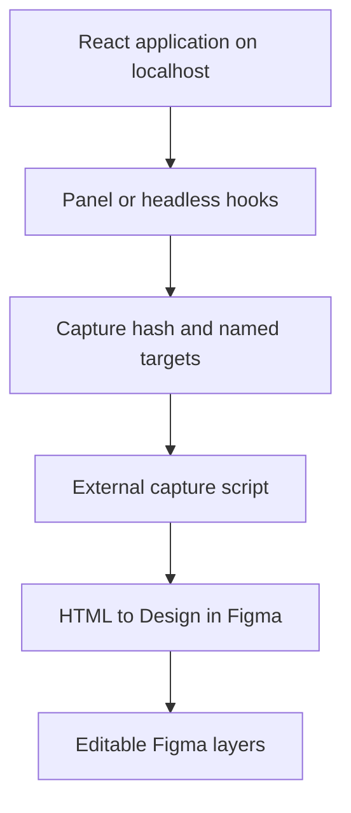

# Architecture and trust boundaries

This document describes the implementation shipped by the repository baseline at package version `0.1.7`. It separates source-backed behavior from framework integrations that are only documented today.

## System flow



The application running in the browser is the source of truth. `pittiquita` prepares that page for a URL-based handoff; it does not convert the page into Figma layers itself.

## Runtime sequence

1. `useLocalOrigin()` starts as `false` and checks `window.location.hostname` after mount.
2. `FigmaCapturePanel` returns `null` unless the hostname is exactly `localhost` or `127.0.0.1`.
3. `useFigmaRegions()` scans visible elements carrying `data-figma-target` or `data-debug-layer` and keeps the list current through `MutationObserver`, navigation events, route props, and manual refresh.
4. Selecting a region calls `scrollIntoView()` and adds `data-figma-selected="true"`. The package does not style that attribute.
5. Activating capture writes `#figmacapture=manual` unless a capture token is already present.
6. When both the local-host and capture-hash conditions are true, `ensureCaptureScript()` appends a script to `<head>` once.
7. The user copies the URL in the browser and hands it to the independent HTML to Design plugin.

The default external script is:

```text
https://mcp.figma.com/mcp/html-to-design/capture.js
```

## Source boundaries

| Area | Owns | Does not own |
| --- | --- | --- |
| `src/core/hooks/` | Local-origin state, capture activation, region observation, and Figma file-reference state. | Prebuilt UI or framework configuration. |
| `src/core/utils/` | Capture constants/script injection, target discovery, labels, and file-key parsing. | Automatic server guards for every direct utility call. |
| `src/react/` | Panel, target wrapper/helper, small UI slots, and inline theme variables. | HTML-to-Figma conversion or production build exclusion. |
| `src/vite/` | A virtual module that mounts the panel while Vite is serving. | Production injection; the plugin uses `apply: 'serve'`. |
| `src/next/` | A development-time config wrapper exported as `withPittiquita`. | Mounting the React panel. The current options are not applied to UI. |
| `playground/` | A local Vite consumer used for manual and demo checks. | A framework compatibility matrix. |
| `tests/` | Vitest/jsdom coverage of core hooks, utilities, and React components. | Real Figma import, React 18 matrix, Next.js integration, real SSR, or isolated Vite runtime integration. |
| `scripts/` | Playwright-driven demo capture. | Product runtime behavior. |
| `docs/demo/` | Versioned PNG, GIF, and WebM evidence plus an illustrative Figma handoff mock. | Evidence of an authenticated, real Figma import. |

## Public package surfaces

`package.json#exports` and `tsup.config.ts` define four public entry points:

| Entry point | Source | Output contract |
| --- | --- | --- |
| `pittiquita` | `src/index.ts` | Components, hooks, utilities, and public types. |
| `pittiquita/hooks` | `src/hooks.ts` | Headless hooks, utilities, labels, and hook types. |
| `pittiquita/vite` | `src/vite/plugin.ts` | Vite plugin. |
| `pittiquita/next` | `src/next/plugin.ts` | Next config wrapper; no panel mounting. |

`tsup` is configured to produce ESM, CommonJS, and declaration files for all four. React, React DOM, Next.js, and Vite are externalized from the build. Only React and React DOM are declared peer dependencies; Next.js and Vite are not declared peers in the current manifest.

## Browser and SSR boundary

The package is SSR-aware, but not every exported function is meaningful on a server:

- `isLocalOrigin()`, `isCaptureActive()`, `enableCaptureHash()`, and `ensureCaptureScript()` check for browser globals before acting.
- Hooks perform DOM work from effects after a client mount.
- `FigmaCapturePanel` starts hidden and only renders after the local-origin effect succeeds.
- `FigmaTarget` can render normal data attributes during SSR.
- Direct DOM utilities such as `buildRegionEntries()` require a browser document and should not be called during server rendering.
- The recommended Next.js App Router integration therefore mounts the panel from a Client Component.

There is no framework-level SSR integration test in the current suite. “SSR-aware” refers to the implemented guards, not a universal guarantee for arbitrary direct utility calls.

## Development and production boundary

Two different guarantees must not be conflated:

| Concern | Current behavior |
| --- | --- |
| Capture panel on a public hostname | The prebuilt panel returns `null` after the origin check. |
| External capture script on a public hostname | `ensureCaptureScript()` does nothing. |
| Vite production build | The Vite plugin does not inject its virtual module because it is serve-only. |
| Manual React/Next import | Bundle inclusion depends on the consumer's environment guard and bundler. |
| Target markup | `FigmaTarget` and `figmaTarget()` emit markup/attributes wherever the consumer renders them. |
| Headless hooks | Consumers must pass the appropriate `enabled` guard; not every hook is local-only by default. |

Applications that require zero package bytes in production should use their framework's compile-time development boundary and verify the resulting bundle.

## Data and network behavior

`pittiquita` has no service endpoint, authentication flow, analytics, or telemetry implementation.

| Event | Local state or network effect |
| --- | --- |
| Import package | No intentional request. |
| Mount panel without capture hash | DOM observation and optional `localStorage` hydration; no capture-script request. |
| Activate capture | Changes `window.location.hash` and appends the configured script. |
| Enter a Figma file URL/key | Kept in React state until opened. |
| Open a Figma file | Stores the entered reference under `figma-file-ref` and opens `https://www.figma.com/design/{fileKey}` with `noopener,noreferrer`. |
| Reset the panel | Clears transient error/status and selection; does not remove the stored file reference. |

The external capture script executes in the application's page and may inspect rendered DOM. It is the primary third-party trust boundary. `scriptSrc`, `nonce`, `integrity`, and `crossOrigin` allow consumers to apply a controlled source and CSP/SRI policy, but the package does not ship a pinned integrity digest.

## Known architectural limits

- Host allowlist: `localhost` and `127.0.0.1` only.
- Capture activation replaces an unrelated existing hash, so hash-router applications require care.
- Region discovery operates in the main document and filters elements with zero area, `display: none`, or `visibility: hidden`.
- Region ordering is based on viewport top/left coordinates at scan time.
- The package only prepares the browser page; conversion fidelity is controlled by HTML to Design.
- The `pittiquita/next` entry point should not be presented as automatic UI injection.

## Verification map

| Claim | Primary evidence |
| --- | --- |
| Local-host guard and script conditions | `src/core/utils/capture.ts`, `tests/core/utils/capture.test.ts`. |
| Panel origin behavior | `src/react/FigmaCapturePanel.tsx`, `tests/react/FigmaCapturePanel.test.tsx`. |
| Region attributes and discovery | `src/react/FigmaTarget.tsx`, `src/core/utils/regions.ts`, related tests. |
| Serve-only Vite plugin | `src/vite/plugin.ts`. |
| Manual Next boundary | `src/next/plugin.ts`, [Next.js guide](../guides/nextjs.md). |
| Formats and exports | `package.json`, `tsup.config.ts`, `pnpm build`, `pnpm pack:check`. |
| Automated baseline | `pnpm test:run` (82 tests across 11 files after reproducible-demo integration; 58 across 9 before the demo tests). |

See [SECURITY.md](../../SECURITY.md) for the vulnerability-reporting process and operational guidance.
